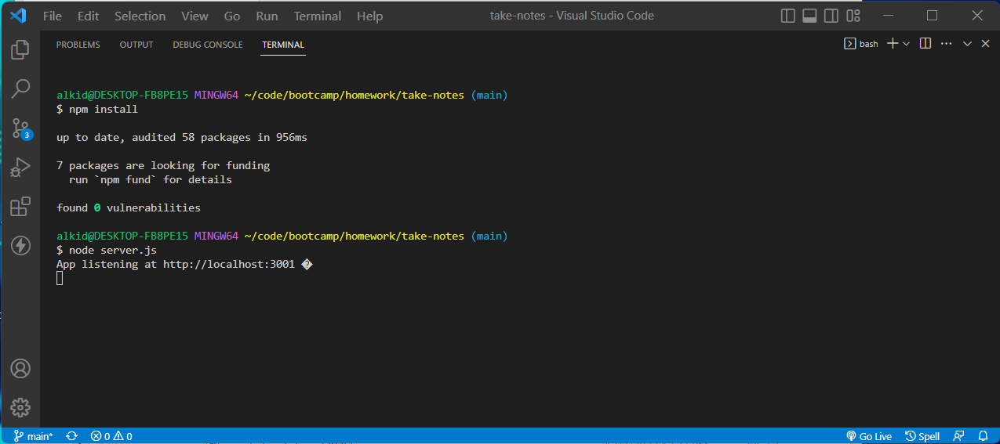

# Take Notes
   
  ## Table of Contents
  - [Description](#description)
  - [Installation](#installation)
  - [Usage](#usage)
  - [Contributing](#contributing)
  - [Questions](#Questions)
  

  ## Description
  🔍 This application is simple page to take notes.  User can write and save notes and so on can organize thoughts and keep track of tasks that need to complete. This application will use an Express.js back end and will save and retrieve note data from a JSON file.
  

  ## Installation
  💾 Run npm install in order to install the following npm package dependencies.

  ## Usage
  
   
  💻 When you run node server.js, in terminal will console 'App listening at http://localhost:3001' where you can click on link and is going to open the page in browser.  
  💻 Application is deployed on [Heroku](https://secure-mountain-00212.herokuapp.com/)
    

  ## License 
  
    
     
  ## Questions
  ✋ Feel free to contact me for any questions: 
  
  ✉️ Email me with any questions: [alkida.vaci@gmail.com](alkida.vaci@gmail.com) 
  :octocat: Find me on GitHub: [alkidavaci](https://github.com/alkidavaci)